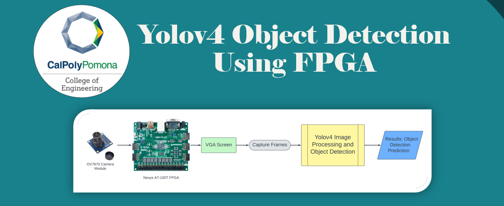
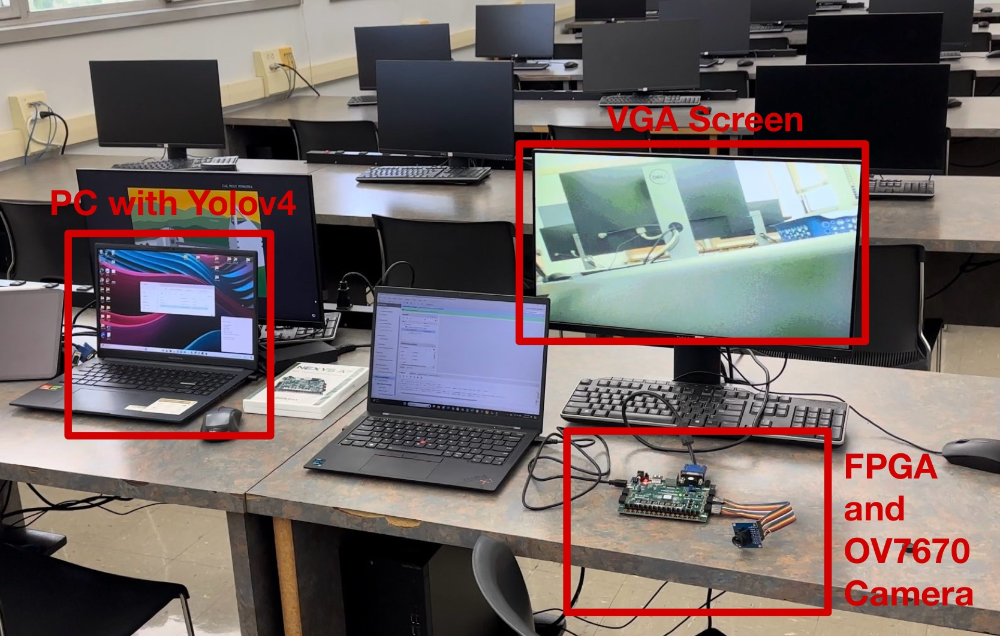
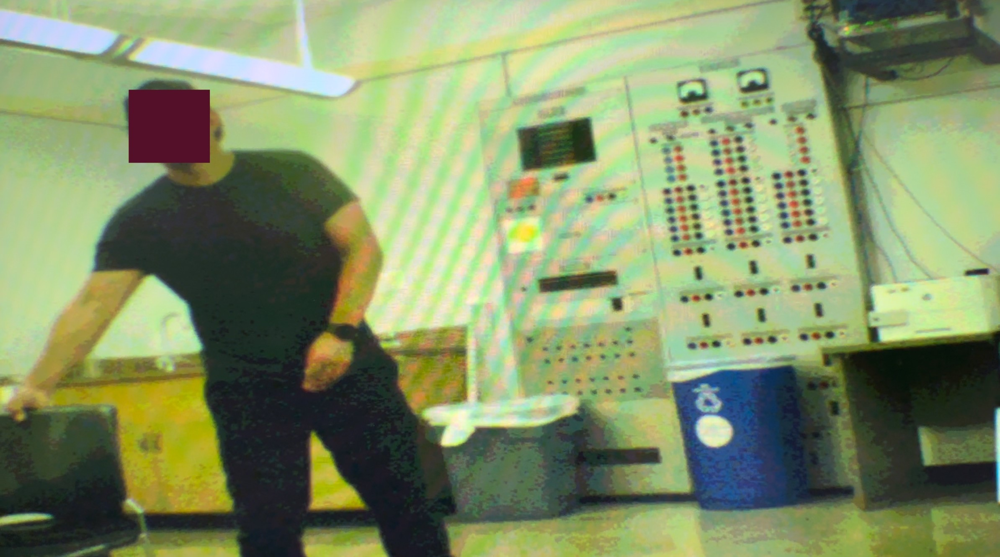
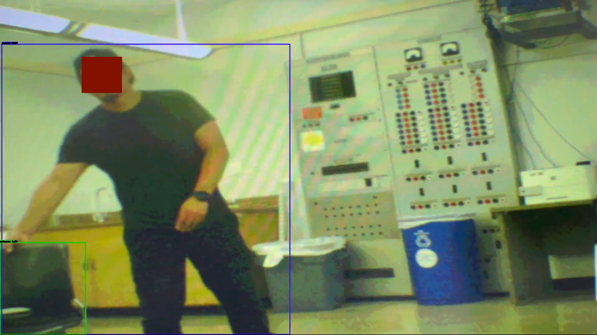

# CPP-ECE-Yolov4-Object-Detection-Using-FPGA

This project details the design and implementation
of an integrated system combining an OV7670 camera module
with a Field Programmable Gate Array (FPGA) for real-time
image acquisition and display, followed by advanced object
detection using the Yolov4 model on a separate PC. The primary
focus was to exploit the FPGA’s rapid processing capabilities
to manage high-volume image data efficiently and to utilize
Yolov4 for its high accuracy in detecting multiple objects. The
project highlights the seamless integration of embedded hardware
with sophisticated machine learning algorithms to achieve real-
time object detection, emphasizing the challenges and successes
encountered during its execution.

## Student Contributors
- (1) Saif Alomari [saifalomari99](https://github.com/saifalomari99)
- (2) Jared Alanis
- (3) Dawson Graf

# Table of Contents
- [CPP-ECE-Yolov4-Object-Detection-Using-FPGA](#CPP-ECE-Yolov4-Object-Detection-Using-FPGA)
  - [Table of Contents](#table-of-contents)
  - [More About Our Project](#More-About-Our-Project)
  - [Tutorials](#Tutorials)
  - [References](#References)

# More About Our Project

# Experiment Setup: 

# Yolov4 Experiment Results: 

# Tutorials
- # Setting Up The HDL System
  asdasdasd
- # Download and Run Yolov4
  sdasdasd

# References
