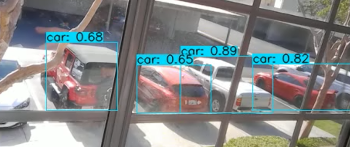
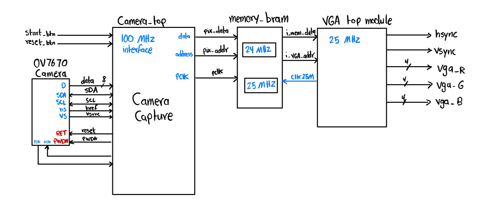

# CPP-ECE-Yolov4-Object-Detection-Using-FPGA

This project details the design and implementation
of an integrated system combining an OV7670 camera module
with a Field Programmable Gate Array (FPGA) for real-time
image acquisition and display, followed by advanced object
detection using the Yolov4 model on a separate PC. The primary
focus was to exploit the FPGA’s rapid processing capabilities
to manage high-volume image data efficiently and to utilize
Yolov4 for its high accuracy in detecting multiple objects. The
project highlights the seamless integration of embedded hardware
with sophisticated machine learning algorithms to achieve real-
time object detection, emphasizing the challenges and successes
encountered during its execution.

## Student Contributors
- (1) Saif Alomari [saifalomari99](https://github.com/saifalomari99)
- (2) Jared Alanis
- (3) Dawson Graf


# Table of Contents
- [CPP-ECE-Yolov4-Object-Detection-Using-FPGA](#CPP-ECE-Yolov4-Object-Detection-Using-FPGA)
  - [Table of Contents](#table-of-contents)
  - [More About Our Project](#More-About-Our-Project)
  - [Tutorials](#Tutorials)
    - Download and Run Yolov4
    - Setting Up The HDL System
  - [References](#References)

# More About Our Project
This paper presents a project that embodies object detection software with an embedded hardware system, utilizing both traditional and cutting-edge technologies to achieve object detection. The project integrates an OV7670 camera module with a Field Programmable Gate Array (FPGA) for image capture and display, followed by object detection using a pre-trained Yolov4 model on a separate computer system.
  - Hardware Requirements:
    - Nexys A7-100T FPGA Developmental Board (1)
    - Female-Female Jumper Pins (16)
    - Female-Male Jumper Pins (4)
    - 4.7k Ohm Pull-Resistors (2)
    - Male-Male VGA Video Connector (1)
    - OV7670 CMOS VGA (640x480) Camera (1)
    - Monitor that supports VGA (1)
    - Breadboard (1)

  - Software Requirement:
    - Vivado.
    - Anaconda Environment with Conda Python installed.
    - Yolov4 Object Detection Model. 

# Experiment Setup: 
The experimental setup, as illustrated in Figure 2, comprehensively demonstrates the integration of the OV7670 camera module with the FPGA, which is further connected to a VGA screen. The OV7670 camera module captures visual data and transmits it to the FPGA via General Purpose Input/Output (GPIO) interfaces. Within the FPGA, this data undergoes initial processing, including formatting and preliminary image adjustments necessary for VGA compatibility. This processed data is then displayed on a VGA screen, allowing for real-time visual verification of the captured images. In this setup, while the FPGA efficiently handles real-time data processing and display, it does not directly communicate
with the computer system running the Yolov4 model. Instead, the video output displayed on the VGA screen is captured and transferred to the PC manually.


# Yolov4 Experiment Results: 

The following picture is captured from the demo video that was done during the experiment. The first picture shows the original capture and the second shows the capture after running it through Yolov4 and it shows the detected objects:


# Tutorials
## Download and Run Yolov4
  - First: We need to install Anaconda with Conda Python:
    
    This tutoial is to show how we can run Anaconda Environment on your device
    This includes Conda for Python as well

    Step 1: Downloading Anaconda for Windows
    
    The following link is to download the Anaconda package that already has Conda in it:
      https://docs.anaconda.com/free/anaconda/install/windows/

    Step 2: Verify The Installation
    
    Now, to verify the installation, type python into the Anaconda PowerShell Prompt:
    ```sh
    python
    ```
    and you get:
    
    Python 3.11.7 | packaged by Anaconda, Inc. | [MSC v.1916 64 bit (AMD64)] on win32
    Type "help", "copyright", "credits" or "license" for more information.


  - Second: YOLOv4 Object Detection Download and Run:
    
    Step 1: Clone Repository from The AI Guy. His work on AI and machine learning techniques is excellent.
    
    Link to the GitHub Repo: https://github.com/theAIGuysCode/yolov4-custom-functions
    
    ```sh
    conda install -c anaconda git
    git clone https://github.com/augmentedstartups/yolov4-custom-functions.git
    ```
        
    Step 2: Enter Conda Virtual Environment
    ```sh
    cd yolov4-custom-functions
    ```
    CPU:
    ```sh
    conda env create -f conda-cpu.yml
    conda activate yolov4-cpu
    ```
    GPU:
    ```sh
    conda env create -f conda-gpu.yml
    conda activate yolov4-gpu
    ```

    Step 3: Download the Weights
    
    Those weights contain the pre-trained data that are necessary to run Yolov4 and can be installed from the "yolov4-custom-functions" GitHub in the README.md section
    Copy and Paste the weights into the /data folder of the repo.
    
    Step 4: Convert weights to TensorFlow Format
    ```sh
    python save_model.py --weights ./data/yolov4.weights --output ./checkpoints/yolov4-416 --input_size 416 --model yolov4
    ```

    if you get an error message about not having tensorflow in your Conda, do the following commands:
    ```sh
    pip install tensorflow-gpu==2.3.0
    pip install opencv-python==4.1.1.26 lxml tqdm absl-py matplotlib easydict pillow pytesseract
    ```

    Step 5: Run YOLOv4

    run using webcam:
    
    ```sh
    python detect_video.py --weights ./checkpoints/yolov4-416 --size 416 --model yolov4 --video 0 --output ./detections/results.avi
    ```
    run using existing video:
    ```sh
    python detect_video.py --weights ./checkpoints/yolov4-416 --size 416 --model yolov4 --video ./data/video/[enter video name here].MOV --output ./detections/results.avi
    ```
    now, you have the resultant video with the detected objects in the results folder inside Yyolov4-custom-functions folder.

    This is an example of running Yolov4: 
      
    

  
## Setting Up The HDL System

    


# References

https://github.com/theAIGuysCode/yolov4-custom-functions
